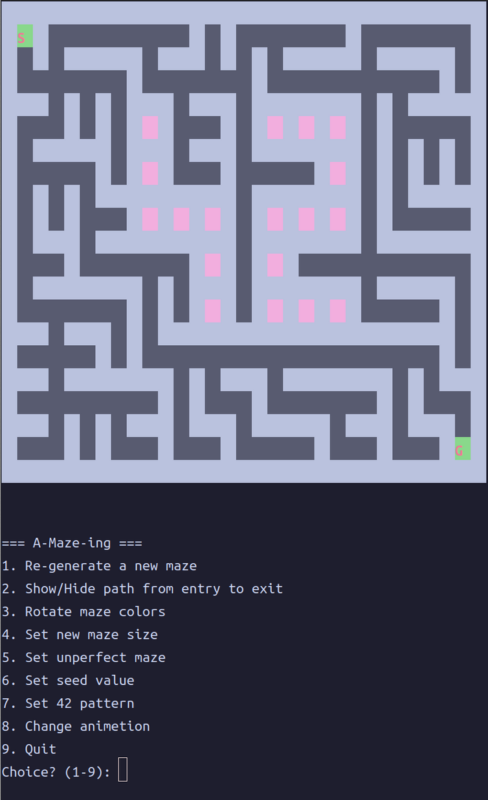

*This project has been created as part of the 42 curriculum by nsato, tenomoto.*  

## 📖*Content*
1. [💡Description](#Description)  
2. [✅Instructions](#Instructions)  
3. [⛏Additional sections](#Additional-sections)  
4. [🌈Resources](#Resources)  

## Description
42Tokyo MileStone2 A-Maze-ing  
***独自の迷路生成器を作成しその結果を表示。***



## Instructions

1. 仮想環境の構築

    `python3 -m venv .venv`

2. 仮想環境のアクティベート
    
    `source .venv/bin/activate` 
    
3. パッケージのインストール
    
    `make install`
    
4. プログラムの実行
    
    `make run`
    

**miscellaneous**

- 動的解析チェック
    
    `make debug`
    
- 静的解析チェック
    
    `make lint`
    
- 厳格な静的解析チェック（mypyを--strictで実行する）
    
    `make lint-strict` 
    
- mazegenのパッケージ化
    
    `make build`

- 不要なファイルの削除
    
    `make clean`
    

## Additional sections

### 1. ファイル構成

```
├── .flake8
├── .git/
├── .gitignore
├── Makefile
├── README.md
├── a_maze_ing.py
├── config.txt
├── maze.txt
├── mazegen/
│   ├── **init**.py
│   └── generator.py
├── pyproject.toml
└── requirements.txt
```

### 2. 設定ファイルの構造とフォーマット

| Key | Description |
| --- | --- |
| WIDTH | 迷路の幅（セル数） |
| HEIGHT | 迷路の高さ（セル数） |
| ENTRY | 入口の座標（x, y） |
| EXIT | 出口の座標（x, y） |
| OUTPUT_FILE | 出力ファイル名 |
| PERFECT | 完全迷路にするか |
| SEED | 迷路の生成を固定 |
| PATTERN | 迷路の真ん中に42スタンプを生成(9×7以上の時のみ) |

### 3. 選択した迷路生成アルゴリズム

__迷路生成__  
棒倒し法(バイナリツリー法)  


__最短経路探索__  
幅優先探索  
>現在座標から移動可能な座標をqueueに追加して、既に訪れた座標を除いてその座標からさらに移動可能な座標をqueueに追加をゴール座標が見つかるまで繰り返す。  
そうすることで、常に最短なルートでゴールまでたどり着くことが出来る。

### 4. このアルゴリズムを選択した理由
__迷路生成__  
>生成方法が直感的に理解しやすく、配列を使った迷路生成と相性が良かったため。  

__最短経路探索__  
>幅優先探索が深さ優先探索と比べて理解もしやすくqueueで管理することでコードが簡潔になったため。  

### 5. コードのどの部分が再利用可能か、およびその方法

今回使用した迷路生成モジュールは再利用可能であり、Pythonライブラリとしてインストールが可能。

1. pyproject.toml(設定ファイル)
    
    ```python
    # このパッケージをビルドするための道具の設定
    [build-system]
    
    # ビルドするときに必要なライブラリのリスト。
    # pip install -e . を実行したとき、Pythonが裏側で使う道具。
    requires = ["setuptools>=61.0"]
    
    #「どのビルド道具を使うか」の具体的な指定。
    # requiresで入れた道具の「どの機能を使うか」まで指定してる。
    build-backend = "setuptools.build_meta"
    
    # このパッケージ自体の情報
    [project]
    
    # パッケージの名前。pip install mazegen のこの部分になる。
    name = "mazegen"
    
    # バージョン番号。`メジャー.マイナー.パッチ` の形式が一般的。
    version = "1.0.0"
    
    # 一行の説明文。pip search や PyPI のページに表示される。
    description = "A-Maze-ing generator module"
    
    # 必要なPythonのバージョン
    requires-python = ">=3.10" 
    
    # このモジュールを動かすために必要な外部ライブラリ。
    # pip install mazegen したとき自動でインストールされる。
    # 今回は何も必要ないので空
    dependencies = []
    
    ###setuptoolsのverについて###
    setuptools 61.0 以上が必要な理由
    61.0 から pyproject.toml を正式にサポートするようになったから。
    setuptools 60.x 以下
    → pyproject.toml を読めない
    → ビルド失敗する可能性がある
    
    setuptools 61.0 以上
    → pyproject.toml を正式サポート
    → 安全にビルドできる
    ```
    
2. インストール
    
    ```jsx
    pip install mazegen-1.0.0-py3-none-any.whl
    ```
    
3. 使い方
    
    ```python
    from mazegen import MazeGenerator
    
    # 迷路生成インスタンス作成、初期化
    generator = MazeGenerator(
    	width: int,
    	height: int,
    	entry_point: tuple[int, int],
    	exit_point: tuple[int, int],
    	perfect: bool,
    	seed: int,
    	pattern: bool
    )
    
    # 迷路生成、出力$
    generator.generate(
    	sleep_anime: bool,
    	print_flag: bool
    )
    
    # 迷路の配列(list[list[int]])受け取り
    maze_str = generator.get_grid()
    
    # 最短経路(str)受け取り$
    path_str = generator.solve_maze()
    
    # 16進数の文字列リスト(list[str])受け取り
    hex_grid = generator.get_hex_grid()
    
    # 迷路の描画
    generator.print_maze(
    	sleep_time: float,
    	show_path: bool,
    	color_id: int
    )
    ```
    

### 6. チーム構成とプロジェクト管理：

### 各チームメンバーの役割
__nsato__
+ 自己管理  
+ configファイルからのパース  
+ 迷路生成アルゴリズム実装  
+ README.md雛形作成  

__tenomoto__
+ アルゴリズム選定  
+ 探索アルゴリズム実装  
+ Makefileの作成  
+ 仮想環境構築  
+ モジュールのパッケージ化  
+ docstring flake8修正  

### 当初の計画と最終段階までの変更経緯
#### 目標スケジュール
2月24日(火) チーム結成。スケジュール整理。  
2月25日(水) スタート。迷路生成アルゴリズムの決定。  
2月26日(木) 迷路生成、ターミナルに出力する。  
2月27日(金) ターミナルに出力する。  
2月28日(土) 迷路調整、完全迷路化、Perfectフラグ対応。  
3月1日(日)  迷路探索アルゴリズムの実装。
3月2日(月) README.md, Makefile作成。  
3月3日(火) 最終チェック。提出。  
3月4日(水) 提出バッファ。  

#### 完遂スケジュール
最終提出  ->  3月6日(金)

### 成功した点と改善点

__nsato__
+ 成功した点  
スケジュール通りとはいかなかったものの、早い進捗で完成まで持っていくことができ、エラーハンドリング等細かい仕様を考慮しながら進められた。  
特に後半のボーナスやユーザー操作等は人間の判断が必要なものであり、AIの助けを借りることはできなかったため、自力で対応できたのはいい経験になった。

+ 改善点  
AIの使用タスク、使いどころを考えるべきだった。  
アルゴリズムの理解や選定、調べるツールとしては利用してもいいと思ったが、課題要件のまとめ、必要なタスクや分担などは人間がチームに応じてやった方がいいし、個人としてその能力も磨くべきだったと感じた。
タスク管理、残作業や方針、課題要件のまとめ等初動を次は丁寧にやっていきたい。

__tenomoto__
+ 成功した点  
作業分担はしたが実装前に各々で使用するアルゴリズムを実際に書いたので、課題の提出だけにフォーカスを当てず、しっかりと学ぶべきポイントをそれぞれが学べたのが良かった。  
相互でのコミュニケーションが多かったので、チームとしてうまく課題に取り組むことができた。

+ 改善点  
当初のスケジュールよりも時間がかかってしまったので、作業の見積もりの精度を上げていくべきだと感じた。  
課題を通して学べることを全て経験したかったので、一旦それぞれで実装してみようと提案したがそれが仇となり、作業分担が曖昧になってしまったので実務を想定するのであれば、双方のコミット時間や理解に応じて適切な作業分担をすべきであった。  
初めてチーム開発でgitを使用したがわからない点が多かったのでより理解を深めていきたい。  

### 特定ツールの使用有無（使用した場合はその名称）

+  Discord
+  Notion
+  [Git hub](https://github.com/nsato-1608/-Flame-Excalibur-Eternal-Force-Blizzard-Lightning-Thunder-Voltechle-/tree/main)

### 7. 高度な機能（複数アルゴリズム、表示オプションなど）実装について

今回は未実装

**インストールしてるパッケージ**

- **flake8**

    Pythonコードのスタイルと文法エラーをチェックするツール。インデントのずれや未使用のimportなど、コードの問題を自動で検出する。
    
- **pep8-naming**
    
    flake8のプラグイン。変数名・関数名・クラス名がPythonの命名規則に沿っているかチェックする。例えば関数名はスネークケース、クラス名はパスカルケースであるかを確認する。
    
- **flake8-docstrings**
    
    flake8のプラグイン。関数やクラスにdocstringが書かれているかチェックする。今回はGoogle式のdocstringフォーマットに準拠しているかを確認する。
    
- **mypy**
    
    Pythonの型ヒントをチェックするツール。`def func(x: int) -> str` のような型ヒントをもとに、型の不一致や型ヒントの漏れを検出する。
    
- **build**
    
    Pythonパッケージをビルドするツール。ソースコードを `.whl` や `.tar.gz` 形式に変換し、`pip install` できる配布可能な形式を生成する。
    

# Resources
+ 参考サイト  
[Python Documentation contents](https://docs.python.org/3/library/index.html)  
[迷路生成・棒倒し法](https://algoful.com/Archive/Algorithm/MazeBar)  
[迷路探索・幅優先探索](https://youtu.be/0_9heBS7Flg?si=gg7M-Xifp698Bdag)  
[ANSI Escape Sequences](https://gist.github.com/fnky/458719343aabd01cfb17a3a4f7296797)  
[mypyオプション](https://qiita.com/keng000/items/8e55e3cfdba888fba290)  
+ AI使用タスク  
__NotionAI__  
>会議内容の文字起こし  

__Gemini__  
>READMEにおけるファイル構成の出力  
ボーナスパートの案出し  

__Special Thanks__  
shayashi